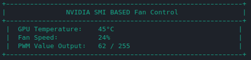

# NVIDIA-SMI-BASED-Fan-Control-Script
NVIDIA SMI Fan Control Script, takes the temperture reading from NVIDIA SMI to control certain fan headers (default are pwm headers 3 and 4). Made with ChatGPT

This script is intended for use with Tesla data center GPUs such as the K80, M40, P40, etc.

Example of the GUI:

